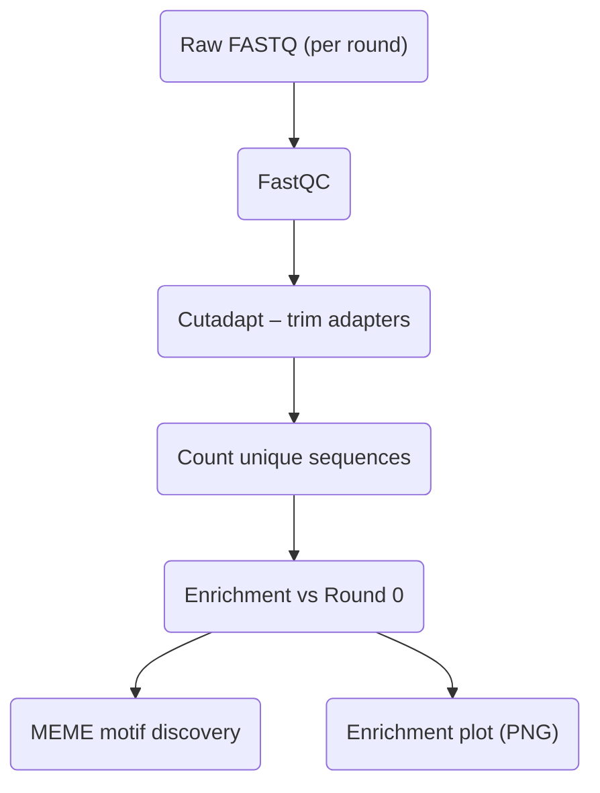

# ht‑selex‑pipeline

**Snakemake workflow for end‑to‑end processing of high‑throughput SELEX (HT‑SELEX) sequencing data.**  
It performs adapter trimming, sequence counting, enrichment analysis versus Round 0, motif discovery with MEME, and automated visualisation, producing publication‑ready outputs from raw FASTQ files in a single command.

---

## Background & Rationale
High‑throughput SELEX iteratively enriches nucleic‑acid libraries for high‑affinity binders (aptamers). Each round is deep‑sequenced, creating gigabytes of reads that must be:

1. **Quality‑checked and adapter‑trimmed** to avoid bias.
2. **Collapsed to unique sequences** and counted per round.
3. **Quantitatively compared** to the naïve pool (Round 0) to identify enriched candidates.
4. **Interrogated for conserved motifs** that underpin binding.
5. **Visualised** for rapid assessment and downstream decision‑making.

Manual, ad‑hoc analysis is error-prone and non-reproducible. This pipeline encapsulates best‑practice steps in an automated, version‑controlled workflow that scales from laptops to HPC clusters.

---

## Workflow Overview



| Step        | Tool / Script                      | Key Output                                   |
|-------------|------------------------------------|----------------------------------------------|
| **QC**      | FastQC                             | `qc/*.zip` (HTML inside)                     |
| **Trim**    | Cutadapt                           | `trimmed/*.trimmed.fastq.gz`                 |
| **Count**   | `scripts/count_seqs.py`            | `counts/*.tsv`                               |
| **Enrich**  | `scripts/calc_enrichment.py`       | `enrichment/enrichment_R*.tsv`               |
| **Motif**   | MEME‑Suite (`meme`)                | `motifs/R*/*` (HTML + logos)                 |
| **Plot**    | `scripts/plot_enrichment.py`       | `plots/enrichment_R*.png`                    |

All dependencies are installed into an isolated **micromamba** environment via `environment.yml`.

---

## Quick Start

```bash
# 1. Clone the repo
git clone https://github.com/Lambda-Epsilon/ht-selex-demo.git
cd ht-selex-pipeline

# 2. Create & activate environment
micromamba env create -f environment.yml
micromamba activate htselex

# 3. Edit config.yaml
#    - datasets: experiment IDs
#    - rounds:   sequencing rounds available
#    - runs:     SRR accessions for automatic download (optional)

# 4. (Optional) Download raw FASTQs
./download_data.sh        # uses runs: from config.yaml

# 5. Run the pipeline on 32 logical cores
snakemake --cores 32 --rerun-incomplete --latency-wait 60
```

Outputs appear under `results/<dataset>/`.

---

## Results (Example demonstration, dataset DRA009383):

| Dataset   | Rounds analysed | Top enriched sequence | Enrichment (R*) | Leading motif (E‑value) |
|-----------|-----------------|-----------------------|-----------------|-------------------------|
| DRA009383 | 0–1             | _GCCAGTAG…_                | **7532.0×**     | **AACTTCGAAAG** (8.2e^-162) |

*Full QC metrics, enrichment tables, motif HTML reports and PNG plots are provided in the `results/` directory.*


---

## File Tree (after successful run)

```
results/
└── DRA009383
    ├── qc/
    ├── trimmed/
    ├── counts/
    ├── enrichment/
    ├── motifs/
    │   └── R1/
    └── plots/
        └── enrichment_R1.png
```

---

## Customisation

| Task                         | How to modify                                                |
|------------------------------|--------------------------------------------------------------|
| Change adapter sequence      | Edit `adapter:` in `config.yaml`                             |
| Add extra rounds             | Append to `rounds:` array                                    |
| Run on cluster               | Provide a Snakemake profile or `--cluster` directive         |
| Increase per‑rule threads    | Adjust `THREADS` in `config.yaml` and rule `threads:` fields |
| Extend motif parameters      | Edit the `meme` rule in `Snakefile`                          |
